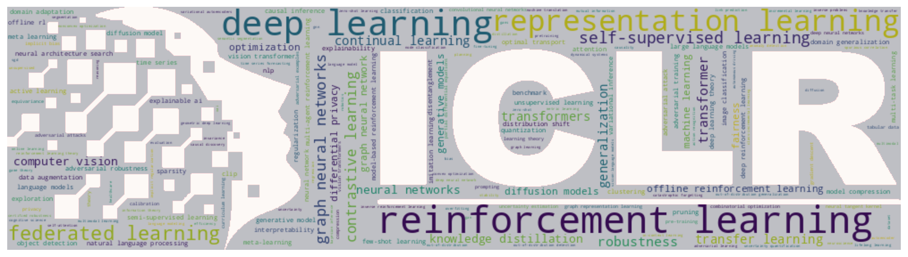
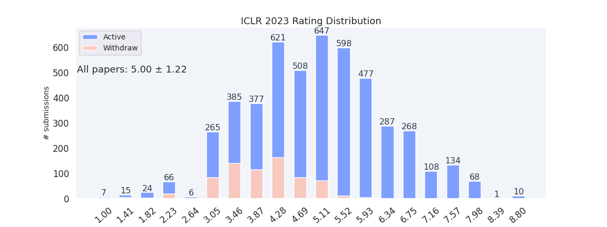
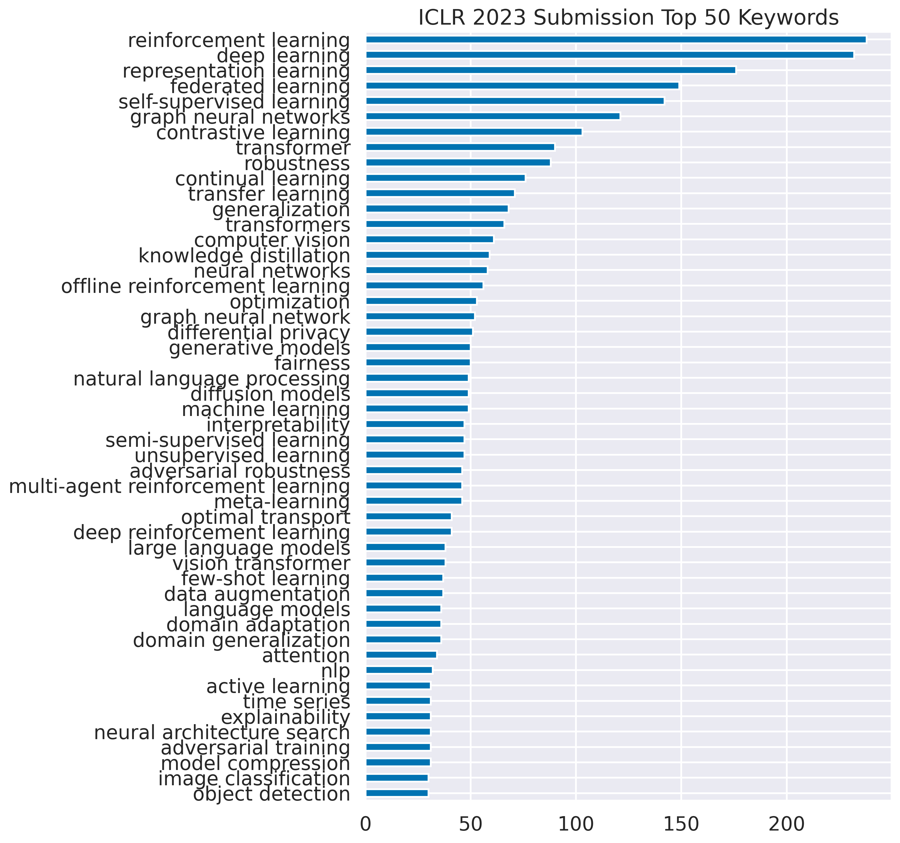
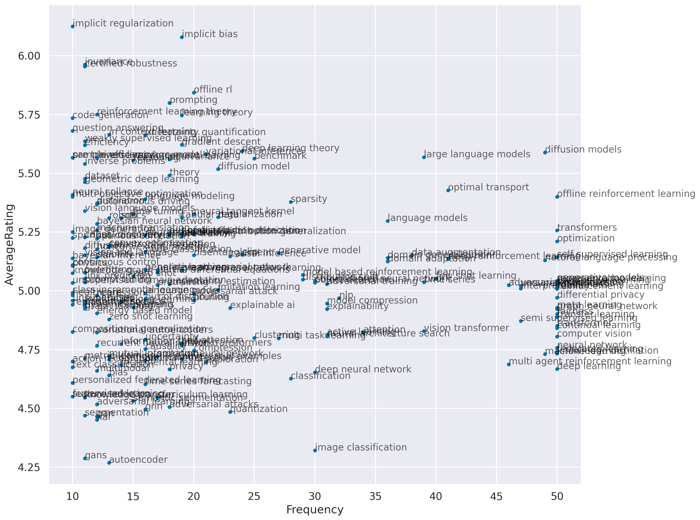
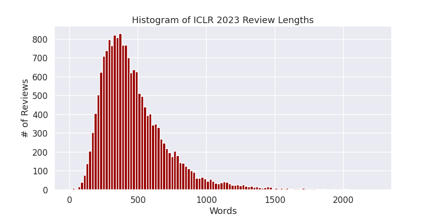
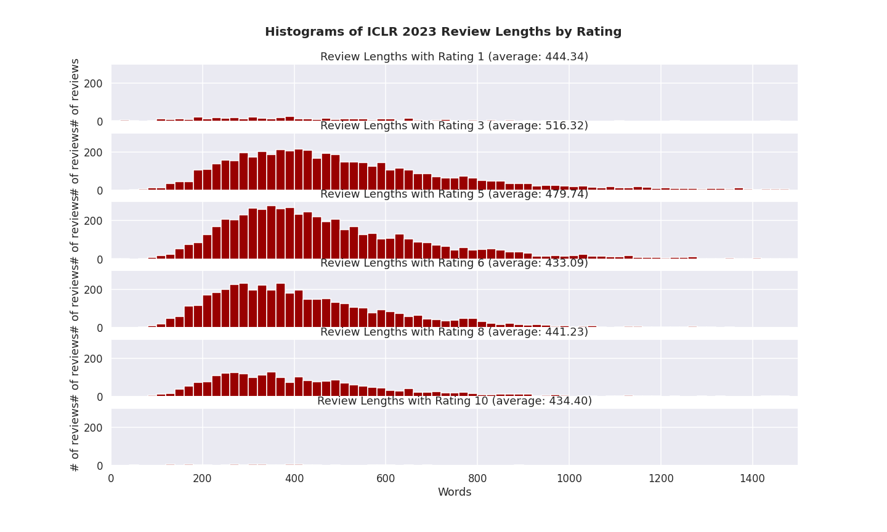
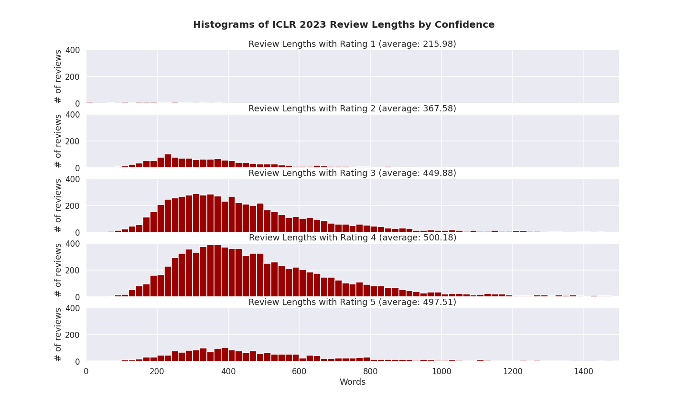
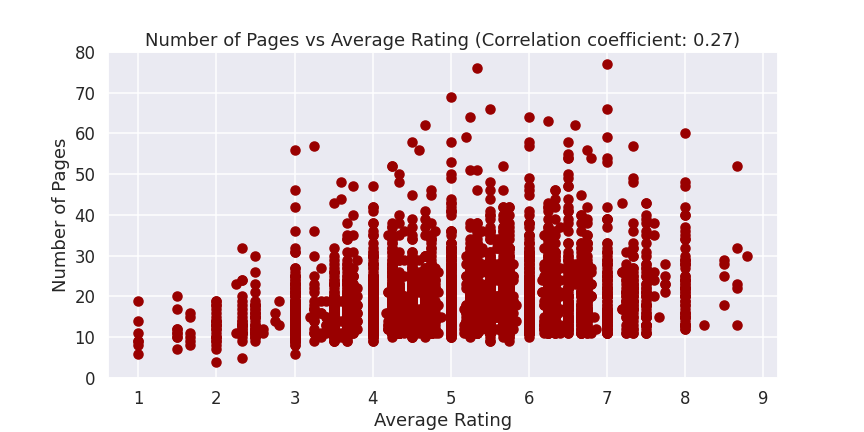

# Crawl and Visualize ICLR 2023 OpenReview Data

[](https://fedebotu.github.io/ICLR2023-OpenReviewData/submissions.html)[](https://drive.google.com/drive/folders/1wCZrwNpjBHq0mXni3xLNrlEMrGUDK-Cl?usp=sharing)


<p align="center">
    
</p>

&rarr; Open full submission list [here](https://fedebotu.github.io/ICLR2023-OpenReviewData/submissions.html)
&rarr; Download datasets [here](https://drive.google.com/drive/folders/1wCZrwNpjBHq0mXni3xLNrlEMrGUDK-Cl?usp=sharing)

## Description

This repository contains code to crawl and visualize the data from the [ICLR 2023 OpenReview](https://openreview.net/group?id=ICLR.cc/2023/Conference). Crawling is done via parallel `requests` directly to OpenReview's API, which is way faster than `selenium` - in the order of `10-100x`. It also saves datasets that can be used for further analysis, including all reviews and rebuttals and PDF files metadata and text.


## Usage
Run:
```shell
pip install -r requirements.txt
```
And run the notebooks under the `notebooks/`  folder:
1. `0a. Parse data.ipynb`: crawl the data from the OpenReview website: all paper metadata (such as title, abstract, authors, etc.), reviews, and rebuttals.
2. `0b. Crawl PDF.ipynb`: parse the PDF files of the papers to extract the main text.
3. `1. Plots.ipynb`: visualize the data using word clouds, bar charts, and other plots.
4. `2. Save Website.ipynb`: save the website as a static HTML file.


## Statistics
- Total submitted papers: `4874` papers
- Average rating: `4.94`


### Rating Distribution
<p align="center">
    
</p> 

### Top 50 Keywords
<p align="center">
    
</p> 

### Keywords vs Ratings
<p align="center">
    
</p> 

### Wordcloud
<p align="center">
    
</p> 

### Review Lengths
<p align="center">
    
</p> 


### Review Lengths by Rating
<p align="center">
    
</p> 


### Review Lengths by Confidence
<p align="center">
    
</p> 

### Paper Length (pages) vs Rating
<p align="center">
    
</p> 

## Feedback
Feel free to open an issue or a pull request if you have any feedback or suggestions!

## Acknowledgements
This repository is inspired by the following:
- Initial idea: https://github.com/evanzd/ICLR2021-OpenReviewData
- Previous year's repo: https://github.com/fedebotu/ICLR2022-OpenReviewData
- For web formatting and API requests: https://github.com/weigq/neurips2021_stats and https://github.com/weigq/iclr2022_stats

